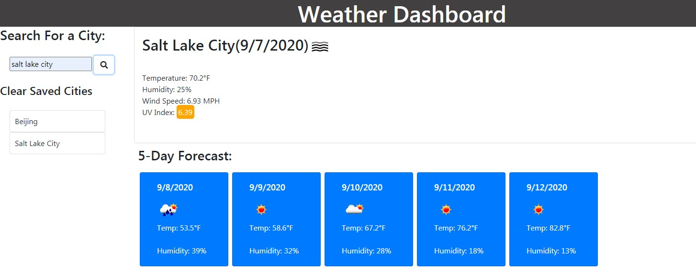

# Weather Dashboard

By using the OpenWeather API this application can find any city and display the weather and 5 day forecast for that location.

## Specifications

```
*When a city is entered into the search field and the search button is pushed, current and future conditions for that city are shown and the searched city is added to a saved list under a button to clear them.
*The current conditions will have the city name, the date, an icon representation of weather conditions, the temperature, the humidity, the wind speed, and the UV index
*The UV index will be color coded to reflect the conditions listed on https://en.wikipedia.org/wiki/Ultraviolet_index
*The 5-day forecast will display the date, an icon representation of weather conditions, the temperature, and the humidity
*Clicking on a city in the search history will function as if that was entered as a search
```

### Screenshots



### Deployed App
https://willsan0723.github.io/weather-dashboard/
